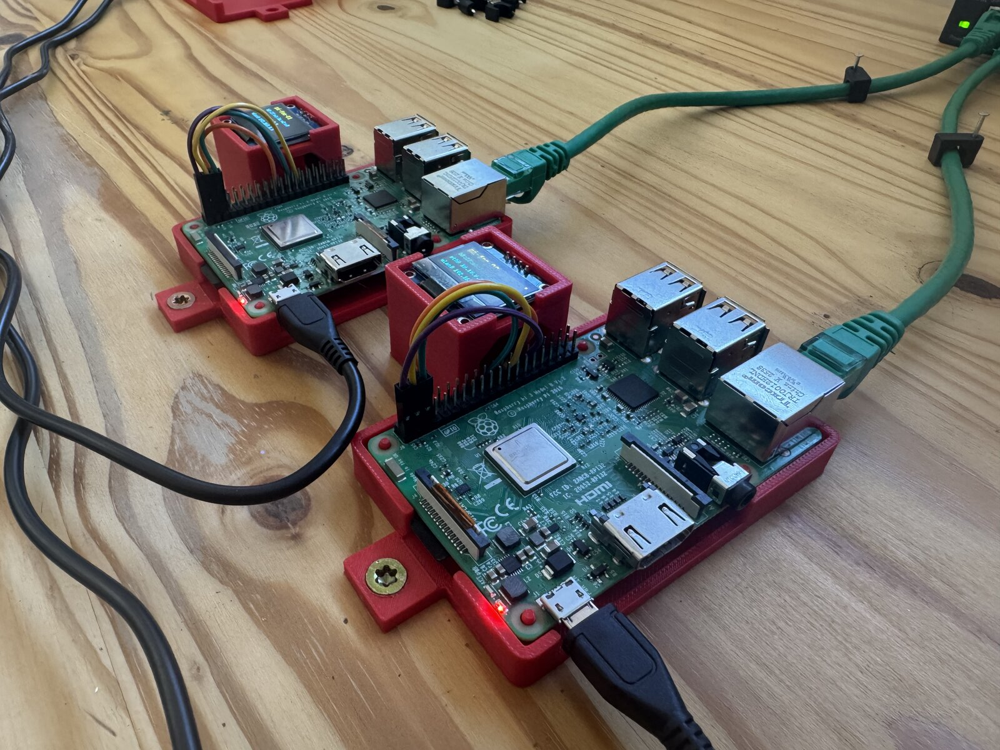
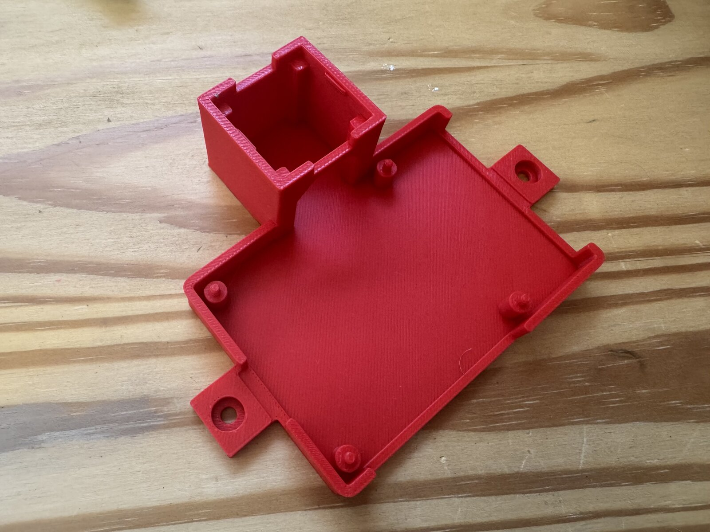

# Pi 3 half-case with OLED stand

A 3D-printable stand for one node of the little internet: an open-top tray that
the **Raspberry Pi 3** drops into, a raised pedestal that holds an
[ELEGOO SSD1306](../../BOM.md) OLED flat, and two flanges so you can screw the
whole thing to a desk or a board and look at it cleanly from top-down.



First, measure your OLED.

The defaults are designed around the BOM parts, but yours might vary even by a
millimeter.

| Parameter    | Default | What it is                                                                |
| ------------ | ------- | ------------------------------------------------------------------------- |
| `oled_w`     | 28      | PCB width                                                                 |
| `oled_h`     | 27      | PCB height                                                                |
| `oled_t`     | 1.5     | PCB thickness                                                             |
| `oled_clear` | 25      | Headroom under the PCB for the pins plus the plugged-in connector housing |

For `oled_clear`, the default 25mm height works with a straight 4-pin header
with Dupont housing pushed on. If you use right-angle headers, you can get away
with less height.

Once you have your measurements, you have two options:

1. **Download the default STL.** Every [release](../../../../releases) has
   `pi3-oled-case.stl` attached, rendered from this `.scad` by CI. Take that if
   your numbers match the defaults.
2. **Render your own** (below), if they don't.

## Render an STL

You need [OpenSCAD](https://openscad.org/downloads.html). Open `pi3-oled.scad`,
edit the parameters at the top, press F6 to render, then **File → Export →
Export as STL**.

From the command line, override parameters with `-D` instead of editing the
file:

```sh
# the whole thing, defaults
openscad -o pi3-oled-case.stl -D 'part="both"' pi3-oled.scad

# your measured OLED
openscad -o pi3-oled-case.stl \
  -D 'part="both"' -D 'oled_w=29.5' -D 'oled_h=27.2' -D 'oled_clear=14' \
  pi3-oled.scad
```

### Fit-test with an OLED stub

Combine `part="oled"` with `oled_stub=true` to print just a short collar of the
stand so you can check that your PCB actually drops in and that the snap tabs
grip.

```sh
openscad -o fit-test.stl -D 'part="oled"' -D 'oled_stub=true' pi3-oled.scad
```

### The three `part` values

| `part`   | What renders                                                                 |
| -------- | ---------------------------------------------------------------------------- |
| `"both"` | Tray and pedestal fused into one printable unit. **This is the real thing.** |
| `"tray"` | Tray only, notch included                                                    |
| `"oled"` | Pedestal only, moved to the origin so it prints on its own                   |

`"tray"` and `"oled"` exist so you can iterate on one half without reprinting
the other. They are **not** two halves that clip together: there's no joint
between them, so a separately-printed pedestal just sits loose next to the tray.


